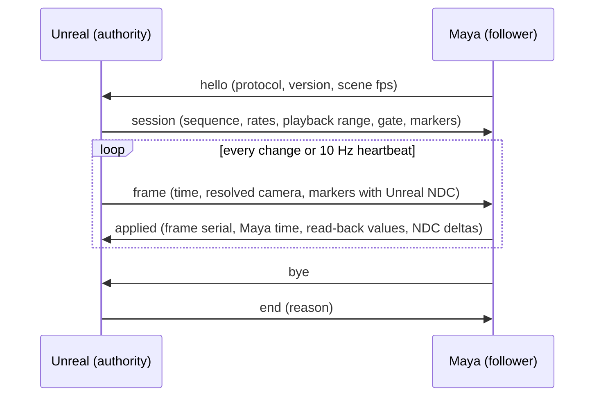

# Camera sync prototype (Issue 52 verification)

Bounded two-host prototype: Unreal evaluates the current camera (including
camera cuts and subsequence shots), Maya applies it to one camera and follows
the Unreal time. It exists to answer whether Unreal's shot can drive Maya's
framing and timeline, and what cannot be expressed on the Maya side.

This is verification scaffolding, not a product. It does not change the
MtoULiveLink product, its protocol (v9), its packages, or its supported
versions.

## Layout

| Path | Contents |
| --- | --- |
| `protocol.md` | Wire schema, time model, axis conversion, parameter mapping classes |
| `official-capabilities.md` | What Autodesk and Epic actually provide, with sources, and the reuse/adapt/missing split |
| `mapping.md` | Measured per-parameter results and the differences that remain |
| `unreal/MtoUCameraSyncPrototype/` | Editor-only publisher module, console commands and Automation tests |
| `maya/MtoUCameraSyncPrototype/` | Maya follower, pure mapping module, host checks and cross-host peer |

## How the two hosts interact



Unreal owns the sequence time, the camera and the output resolution. Maya owns
nothing but the application of what it received; it restores its previous
current time when the session ends. The prototype never writes animation
assets, keys, or playback ranges on either side, and no client message can move
the Unreal time.

## Reproduce

1. Build the Unreal host project that loads the prototype plugin:

   ```
   <Engine>/Engine/Build/BatchFiles/Build.bat UnrealEditor Win64 Development <repo>/unreal/ToolsLab.uproject -WaitMutex -NoHotReloadFromIDE
   ```

2. Run the Unreal-only checks:

   ```
   <Engine>/Engine/Binaries/Win64/UnrealEditor-Cmd.exe <repo>/unreal/ToolsLab.uproject -unattended -nop4 -nosplash -NullRHI -DDC-ForceMemoryCache -ExecCmds="Automation RunTests MtoUCameraSyncPrototype" -TestExit="Automation Test Queue Empty"
   ```

3. Run the Maya-side checks and the cross-host session:

   ```
   <mayapy> -m unittest discover -s composite/MtoULiveLink/prototypes/camera-sync/maya/MtoUCameraSyncPrototype/tests -t composite/MtoULiveLink/prototypes/camera-sync/maya/MtoUCameraSyncPrototype
   <mayapy> composite/MtoULiveLink/prototypes/camera-sync/maya/MtoUCameraSyncPrototype/tests/maya_host_camera_tests.py
   ```

   The cross-host session is started by the Unreal test
   `MtoUCameraSyncPrototype.RealMayaPeer`, which launches the Maya peer and
   passes it a fixture file:

   ```
   UnrealEditor-Cmd.exe <repo>/unreal/ToolsLab.uproject -unattended -nop4 -nosplash -NullRHI ^
     -ExecCmds="Automation RunTests MtoUCameraSyncPrototype.RealMayaPeer" -TestExit="Automation Test Queue Empty" ^
     "-MtoUCameraSyncMayapy=<mayapy>" ^
     "-MtoUCameraSyncPeer=<repo>/composite/MtoULiveLink/prototypes/camera-sync/maya/MtoUCameraSyncPrototype/tests/maya_camera_sync_peer.py" ^
     "-MtoUEvidence=<evidence directory>"
   ```

## Supported by the prototype

- One perspective cinematic camera per session, resolved through the engine's
  camera cut evaluation, in a root sequence or in a subsequence shot.
- Unreal-driven timeline: play, pause, seek by display frame, play rate and
  looping, with Maya following frame offsets across differing frame rates and
  non-zero playback start frames.
- World transform, focal length, film back, film offsets, film fit, f-stop,
  focus distance, depth-of-field enablement, near clip, and the Maya resolution
  gate, which follows the film aperture's pixel extent rather than the full
  output resolution because Maya derives the axis it does not keep from its
  gate aspect.
- Known spatial markers used as framing evidence, compared in one shared
  normalized space and, on the Maya side, in a rendered frame.

## Not supported (reported, never approximated)

- Unreal overscan (uniform and asymmetric) and its resolution fraction.
- Unreal's unbounded far clip: Maya always needs a finite plane, so the
  substituted value is reported.
- Extra depth-of-field shaping (blade count, Petzval bokeh, blur radius and
  amount, transition regions, occlusion) and any claim of image-identical
  bokeh between the two renderers.
- Orthographic cameras, multiple simultaneous cameras on one client, and
  camera cuts owned by nested subsequences of a subsequence.
- Output resolution discovery from Movie Render Pipeline settings; the
  resolution is a prototype input and its source is reported.
- PIE, packaged builds, and any product packaging or installation.

## Known host limit

In the cross-host sessions on this machine the Maya client appended extra bytes
after two of its messages (28112 bytes in the recorded run). The publisher reads
the first complete JSON object per line, counts and reports the discarded bytes
(`client_line_anomalies`, `client_trailing_bytes`), and no applied value was
affected. The same client is byte-clean against a plain Python server, and a
non-Maya client is byte-clean against this publisher; the cause was not isolated
further and is recorded rather than papered over.

## Related records

- [Issue 52 acceptance](../../../../docs/project-history/mtou-livelink/issue-52-camera-sync-acceptance.md)
- [Preview workflow roadmap](../../docs/preview-workflow-roadmap.md)
