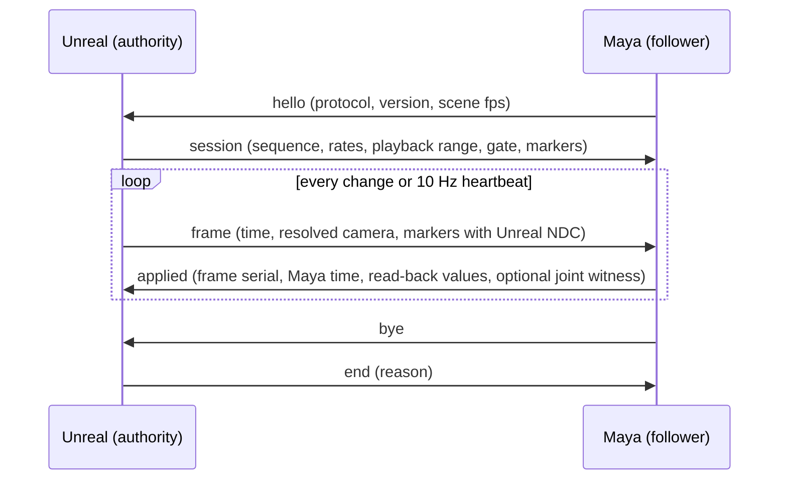

# Camera sync prototype (Issue 52 verification)

Bounded two-host prototype: Unreal evaluates the current camera (including
camera cuts and subsequence shots), Maya applies it to one camera and follows
the Unreal time. The editor mode follows the user's open Sequencer. An opt-in
test peer samples one keyed Maya joint and returns a pose witness with the
camera frame identity; Unreal only applies a matching witness to a disposable
actor. The prototype protocol is **v2**: frames carry an evaluation identity
(`eval_serial`, `eval_identity`) that is separate from the transport serial. The
identity names the sequence time at milli-tick precision and the published
content of the evaluated camera, so a slow report for a still-current paused
target still pairs, while editing that camera at the same time starts a new
target, and acceptance requires the final target to converge. This verifies a
small paused-frame loop, not product pose streaming or continuous playback.

This is verification scaffolding, not a product. It does not change the
MtoULiveLink product, its protocol (v9), its packages, or its supported
versions.

## Layout

| Path | Contents |
| --- | --- |
| `protocol.md` | Wire schema, time model, axis conversion, parameter mapping classes |
| `official-capabilities.md` | What Autodesk and Epic actually provide, with sources, and the reuse/adapt/missing split |
| `mapping.md` | Measured per-parameter results and the differences that remain |
| `unreal/MtoUCameraSyncPrototype/` | Editor-only publisher module, console commands and Automation tests |
| `maya/MtoUCameraSyncPrototype/` | Maya follower, pure mapping module, host checks and cross-host peer |

## How the two hosts interact



Unreal owns the sequence time, the camera and the output resolution. Maya
follows an explicit time-origin mapping and restores its previous current time
when the session ends. The prototype never writes animation assets, keys, or
playback ranges on either side, and no client message can move the Unreal time.

## Reproduce

1. Build the Unreal host project that loads the prototype plugin:

   ```
   <Engine>/Engine/Build/BatchFiles/Build.bat UnrealEditor Win64 Development <repo>/unreal/ToolsLab.uproject -WaitMutex -NoHotReloadFromIDE
   ```

2. Open a Level Sequence in the Unreal editor and run
   `MtoUCameraSyncPrototype.StartEditor [Port] [Width] [Height]` in the console.
   Scrubbing, pausing, camera cuts and shot focus now use that Sequencer's
   evaluated time and camera. `MtoUCameraSyncPrototype.Stop` ends follow.
   `MtoUCameraSyncPrototype.Start <SequenceAssetPath>` remains an isolated
   sequence-player fixture for comparison.

3. Run the Unreal-only checks:

   ```
   <Engine>/Engine/Binaries/Win64/UnrealEditor-Cmd.exe <repo>/unreal/ToolsLab.uproject -unattended -nop4 -nosplash -NullRHI -DDC-ForceMemoryCache -ExecCmds="Automation RunTests MtoUCameraSyncPrototype" -TestExit="Automation Test Queue Empty"
   ```

4. Run the Maya-side checks and the cross-host session:

   ```
   <mayapy> -m unittest discover -s composite/MtoULiveLink/prototypes/camera-sync/maya/MtoUCameraSyncPrototype/tests -t composite/MtoULiveLink/prototypes/camera-sync/maya/MtoUCameraSyncPrototype
   <mayapy> composite/MtoULiveLink/prototypes/camera-sync/maya/MtoUCameraSyncPrototype/tests/maya_host_camera_tests.py
   ```

   The cross-host session is started by the Unreal test
   `MtoUCameraSyncPrototype.RealMayaPeer`, which launches the Maya peer and
   passes it a fixture file:

   ```
   UnrealEditor-Cmd.exe <repo>/unreal/ToolsLab.uproject -unattended -nop4 -nosplash -NullRHI ^
     -ExecCmds="Automation RunTests MtoUCameraSyncPrototype.RealMayaPeer" -TestExit="Automation Test Queue Empty" ^
     "-MtoUCameraSyncMayapy=<mayapy>" ^
     "-MtoUCameraSyncPeer=<repo>/composite/MtoULiveLink/prototypes/camera-sync/maya/MtoUCameraSyncPrototype/tests/maya_camera_sync_peer.py" ^
     "-MtoUEvidence=<evidence directory>"
   ```

## Supported by the prototype

- One perspective cinematic camera per session, resolved through the engine's
  camera cut evaluation, in a root sequence or in a subsequence shot.
- Unreal-driven timeline: editor playhead follow for paused seeks and cuts;
  isolated-player tests additionally cover play, pause, play rate and looping.
  Maya follows explicit origins across differing rates and non-zero starts,
  evaluating subframes without rounding.
- An opt-in keyed-joint pose witness returned to Unreal with the same session,
  evaluation identity, serial, camera and time. Old, duplicate and mismatched
  reports cannot move the disposable Unreal witness actor; reconnects receive a
  new identity, and heartbeats for an unchanged target never invalidate a
  report that is in flight, yet still carry a pose that was edited at the parked
  frame. A stopped timeline has to converge: the target that is current when
  following ends must have been answered.
- The natural editor loop, not only driven tests: the module's own ticker
  advances the session while a live Maya process follows a playhead drag across
  the camera cut, a camera edited at the parked frame, a closed and reopened
  sequence, a dropped and rejoined connection, and repeated start/stop cycles.
  Every session ends with the target that is current answered, and Maya reports
  what it released (time, resolution gate, camera, socket, callback).
- World transform, focal length, film back, film offsets, film fit, f-stop,
  focus distance, depth-of-field enablement, near clip, and the Maya resolution
  gate, which follows the film aperture's pixel extent rather than the full
  output resolution because Maya derives the axis it does not keep from its
  gate aspect.
- Known spatial markers used as framing evidence, compared in one shared
  normalized space and, on the Maya side, in a rendered frame.

## Not supported (reported, never approximated)

- Unreal overscan (uniform and asymmetric) and its resolution fraction.
- Unreal's unbounded far clip: Maya always needs a finite plane, so the
  substituted value is reported.
- Extra depth-of-field shaping (blade count, Petzval bokeh, blur radius and
  amount, transition regions, occlusion) and any claim of image-identical
  bokeh between the two renderers.
- Orthographic cameras, multiple simultaneous cameras on one client, and
  camera cuts owned by nested subsequences of a subsequence.
- Output resolution discovery from Movie Render Pipeline settings; the
  resolution is a prototype input and its source is reported.
- PIE, packaged builds, and any product packaging or installation.
- Product MtoULiveLink pose streaming, continuous editor playback latency and
  drop policy, and full-character same-frame application.

## Transport check

The earlier apparent trailing data came from the Unreal receiver constructing
an unbounded string from a length-delimited UTF-8 conversion. The receiver now
uses the converter's explicit length. The real editor/Maya test requires zero
`client_line_anomalies`, zero `client_trailing_bytes`, every application report
intact, zero failed sends, and that the final evaluation target converged within
a bounded wait. A deliberately malformed multibyte suffix is also checked for an
exact UTF-8 byte count.

Per pump, Unreal drains the complete client lines it has already buffered before
reading the socket (at most 64 lines, 256 KiB received) and buffers no more than
one message plus one read; a message longer than 64 KiB without a complete line
fails the session closed instead of growing the buffer, and a dropped connection
discards its partial line. The report evidence queue is capped as well. Both
bounds keep a slow or flooding client from turning one editor tick into
unbounded work, and the buffered remainder still drains when the sender has gone
silent.

Stopping follow closes the listener thread before it closes the sockets that
thread accepted, so a connection arriving inside the shutdown window cannot
outlive the session; the host check hammers the port while the session stops and
requires every connection to be closed and the port to be free afterwards. The
client receives the `end` line on a half-closed stream, and a client that stops
accepting a line is dropped instead of holding an editor tick for the send
deadline.

## Related records

- [Issue 52 acceptance](../../../../docs/project-history/mtou-livelink/issue-52-camera-sync-acceptance.md)
- [Preview workflow roadmap](../../docs/preview-workflow-roadmap.md)
