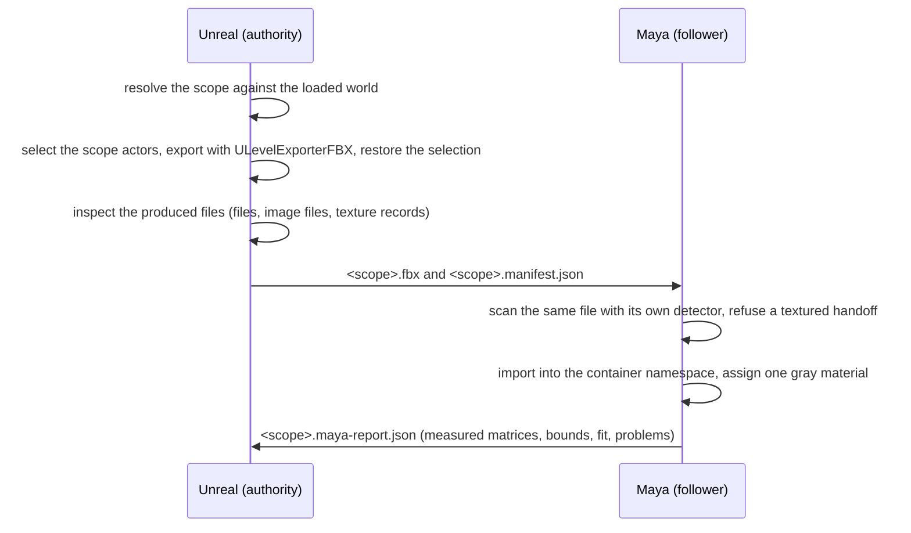

# Scene reference prototype (Issue 53 verification)

Bounded two-host prototype: Unreal exports the static geometry of an explicitly
chosen **level scope** with its own FBX level exporter, and Maya imports that
file into one identifiable container as a texture-free gray reference, then
compares what it holds against a manifest of the engine-evaluated world
transforms. It exists to answer what the official export route really delivers,
what it silently drops, and what a product would have to add.

This is verification scaffolding, not a product. It does not change the
MtoULiveLink product, its protocol (v9), its packages, or its supported
versions, and it adds no dependency to either host.

## Layout

| Path | Contents |
| --- | --- |
| `transfer.md` | The frozen contract: scope semantics, output layout, texture rule, manifest and report schemas, commands |
| `official-capabilities.md` | What Unreal and Maya actually provide, with source references, and the measured behaviour of each candidate path |
| `unreal/MtoUSceneRefPrototype/` | Editor-only exporter, fixture builder, produced-file inspection and Automation tests |
| `maya/MtoUSceneRefPrototype/` | Maya importer/verifier, pure mapping module, host checks |

## How the two hosts interact



Unreal owns the geometry, the world transforms and the manifest. Maya owns
nothing but the import, the comparison and the report; it never loads a level,
touches an object outside its container, or saves a scene.

## Reproduce

1. Build the host project that loads the prototype plugin:

   ```
   <Engine>/Engine/Build/BatchFiles/Build.bat UnrealEditor Win64 Development <repo>/unreal/ToolsLab.uproject -WaitMutex -NoHotReloadFromIDE
   ```

2. Run the Unreal-side checks (they build the fixture themselves) and, with the
   three arguments, the cross-host check:

   ```
   <Engine>/Engine/Binaries/Win64/UnrealEditor-Cmd.exe <repo>/unreal/ToolsLab.uproject -unattended -nop4 -nosplash -NullRHI -DDC-ForceMemoryCache ^
     -ExecCmds="Automation RunTests MtoUSceneRefPrototype" -TestExit="Automation Test Queue Empty" ^
     "-MtoUSceneRefMayapy=<mayapy>" ^
     "-MtoUSceneRefPeer=<repo>/composite/MtoULiveLink/prototypes/scene-reference/maya/MtoUSceneRefPrototype/scripts/MtoUSceneRefPrototype.py" ^
     "-MtoUEvidence=<evidence directory>"
   ```

3. Run the Maya-side checks, or one handoff by hand:

   ```
   <mayapy> -m unittest discover -s composite/MtoULiveLink/prototypes/scene-reference/maya/MtoUSceneRefPrototype/tests -t composite/MtoULiveLink/prototypes/scene-reference/maya/MtoUSceneRefPrototype
   <mayapy> composite/MtoULiveLink/prototypes/scene-reference/maya/MtoUSceneRefPrototype/tests/maya_host_scene_ref_tests.py --result <json>
   <mayapy> composite/MtoULiveLink/prototypes/scene-reference/maya/MtoUSceneRefPrototype/scripts/MtoUSceneRefPrototype.py --fbx <scope>.fbx --manifest <scope>.manifest.json --report <json>
   ```

## The fixture

Generated, never committed (`/Game/MtoUSceneRefFixture`, deleted and rebuilt on
every fixture build):

| Level | Contents |
| --- | --- |
| `MtoUSceneRef_Host` (persistent) | `SM_Pillar_Offset` (off origin, rotated, uniform scale), `SM_Plate_NonUniform` (non-uniform scale), `SM_Cone_Asymmetric` (the mirror probe: an engine mesh scaled until its vertex centroid sits several centimetres off its pivot, which is the only sample a mirrored placement moves while position and bounds stay equal), `ISM_Cluster` (an instanced component with three world-space instances, one of them non-uniformly scaled), `BP_SceneRefMulti` (a Blueprint actor with a cube and a cylinder component), `Light_ReportedOnly` and the level's own default actors, which exist to be reported as skipped |
| `MtoUSceneRef_Loaded` (sublevel, in the world) | two static meshes |
| `MtoUSceneRef_Textured` (sublevel, in the world) | one sphere with a material whose BaseColor is a texture sample parameter |
| `MtoUSceneRef_Unloaded` (saved level, **not** in the world) | one cube that must never reach the export |

## Supported by the prototype

- One scope per run: the loaded persistent level plus the sublevels the caller
  names. Every requested sublevel the loaded world does not hold is reported;
  every sublevel the world holds but the caller did not name is reported as
  excluded. The scope never narrows to the editor selection and never widens to
  every loaded level.
- Static mesh geometry, also when it comes from a Blueprint actor's components,
  an instanced static mesh component, or a component that is not the actor's
  root; landscapes are classified and carried as one object per landscape actor.
- Per object: world position, rotation, scale, matrix and world axis-aligned
  bounds, as the engine evaluated them; geometry scale (actors, components,
  objects, triangles, vertices) before the export; export and inspection
  seconds; and the process's used physical memory. No performance promise is
  attached to any of those numbers.
- A handoff that records no texture: the exporter reports the files it wrote,
  the image files it found, the texture records it read and the file names those
  records mentioned; the Maya side repeats the scan with its own detector and
  refuses to import a textured handoff.
- Maya side: one container namespace and group, one gray material on every
  imported mesh, repeated runs that replace only their own container, and a
  report that names every mismatch instead of skipping it.
- Placement verification is four numbers per object, all compared under the axis
  map the handoff actually used: world position, world bounding box size, the
  pivot-to-bounds-centre offset, and the area-weighted surface centroid of the
  mesh's triangles. The last one is the only one of the four that a mirrored
  placement moves, which is why the fixture carries a sample scaled until that
  centroid sits far outside the tolerance.

## Not supported (reported, never approximated)

- Level instances: `IsSomethingToExport` refuses them with
  `"Exporting Level Instances to FBX is not supported."`; the scope resolver
  reports each one with that reason.
- Nanite source meshes (`bExportSourceMesh` stays off), skeletal meshes,
  cameras, lights and emitters as *geometry*: they are reported as skipped
  non-geometry, not silently exported or dropped.
- Unloaded World Partition cells: they are not in the loaded world, so they are
  reported like any other level the world does not hold. No World Partition map
  was built for this verification.
- Any material, texture, light or camera transfer, and any claim that the
  imported shading matches Unreal's.
- A texture-free claim by flag: the check is on the produced file. The official
  OBJ level export is measured in `official-capabilities.md` precisely because
  it cannot produce a texture-free output in an automated run.
- Reference origin offsets, and any correction of the axis convention on
  import: the prototype imports what the file says and reports the mapping it
  measured.

## Related records

- [Issue 53 acceptance](../../../../docs/project-history/mtou-livelink/issue-53-scene-reference-acceptance.md)
- [Official capability review](official-capabilities.md)
- [Transfer contract](transfer.md)
- [Preview workflow roadmap](../../docs/preview-workflow-roadmap.md)
- [Camera sync prototype](../camera-sync/README.md), whose world conversion this
  verification is compared against
