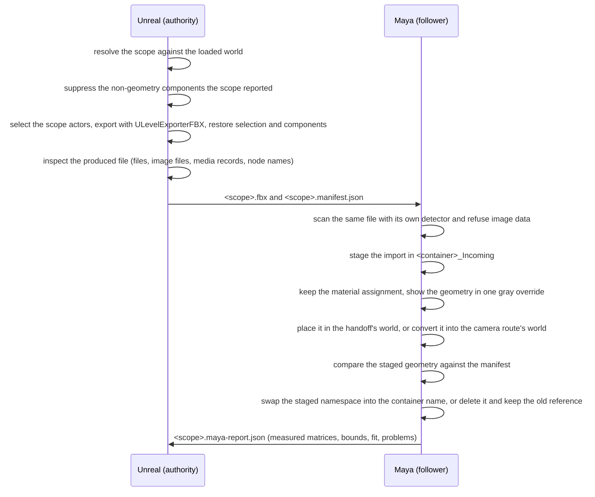

# Scene reference prototype (Issue 53 verification)

Bounded two-host prototype: Unreal exports the static geometry of an explicitly
chosen **level scope** with its own FBX level exporter, and Maya stages that file
in its own namespace, keeps the material assignment the file carries, shows the
geometry in one uniform gray, places it in the handoff's world (or, on request,
in the camera route's world by one explicit conversion), compares what it holds
against a manifest of the engine-evaluated world transforms, and only then
replaces the previous reference. It exists to answer what the official export
route really delivers, what it silently drops, and what a product would have to
add.

This is verification scaffolding, not a product. It does not change the
MtoULiveLink product, its protocol (v9), its packages, or its supported
versions, and it adds no dependency to either host.

## Layout

| Path | Contents |
| --- | --- |
| `transfer.md` | The frozen contract: scope semantics, media rule, worlds and the node matrix, output layout, manifest and report schemas, update semantics, commands |
| `official-capabilities.md` | What Unreal and Maya actually provide, with source references, and the measured behaviour of each candidate path |
| `unreal/MtoUSceneRefPrototype/` | Editor-only exporter, fixture builder, produced-file inspection and Automation tests |
| `maya/MtoUSceneRefPrototype/` | Maya importer/verifier, pure mapping module, host checks |

## How the two hosts interact



Unreal owns the geometry, the world transforms and the manifest. Maya owns
nothing but the import, the comparison, the update and the report; it never loads
a level, touches an object outside its container, or saves a scene.

## Reproduce

1. Build the host project that loads the prototype plugin:

   ```
   <Engine>/Engine/Build/BatchFiles/Build.bat UnrealEditor Win64 Development <repo>/unreal/ToolsLab.uproject -WaitMutex -NoHotReloadFromIDE
   ```

2. Run the Unreal-side checks (they build the fixture themselves) and, with the
   three arguments, the cross-host check:

   ```
   <Engine>/Engine/Binaries/Win64/UnrealEditor-Cmd.exe <repo>/unreal/ToolsLab.uproject -unattended -nop4 -nosplash -NullRHI -DDC-ForceMemoryCache ^
     -ExecCmds="Automation RunTests MtoUSceneRefPrototype" -TestExit="Automation Test Queue Empty" ^
     "-MtoUSceneRefMayapy=<mayapy>" ^
     "-MtoUSceneRefPeer=<repo>/composite/MtoULiveLink/prototypes/scene-reference/maya/MtoUSceneRefPrototype/scripts/MtoUSceneRefPrototype.py" ^
     "-MtoUEvidence=<evidence directory>"
   ```

3. Run the Maya-side checks, or one handoff by hand:

   ```
   <mayapy> -m unittest discover -s composite/MtoULiveLink/prototypes/scene-reference/maya/MtoUSceneRefPrototype/tests -t composite/MtoULiveLink/prototypes/scene-reference/maya/MtoUSceneRefPrototype
   <mayapy> composite/MtoULiveLink/prototypes/scene-reference/maya/MtoUSceneRefPrototype/tests/maya_host_scene_ref_tests.py --result <json>
   <mayapy> composite/MtoULiveLink/prototypes/scene-reference/maya/MtoUSceneRefPrototype/scripts/MtoUSceneRefPrototype.py --fbx <scope>.fbx --manifest <scope>.manifest.json --report <json>
   ```

## The fixture

Generated, never committed (`/Game/MtoUSceneRefFixture`, deleted and rebuilt on
every fixture build):

| Level | Contents |
| --- | --- |
| `MtoUSceneRef_Host` (persistent) | `SM_Pillar_Offset` (off origin, rotated, uniform scale), `SM_Plate_NonUniform` (non-uniform scale), `SM_Cone_Asymmetric` (the mirror probe: an engine mesh scaled until its vertex centroid sits several centimetres off its pivot, which is the only sample a mirrored placement moves while position and bounds stay equal), `ISM_Cluster` (an instanced component with three world-space instances, one of them non-uniformly scaled), `BP_SceneRefMulti` (a Blueprint actor with a cube and a cylinder component), `BP_SceneRefMixed` (a Blueprint actor mixing a mesh, a light, a camera and a child-actor component: the filter probe), `Light_ReportedOnly` and the level's own default actors, which exist to be reported as skipped |
| `MtoUSceneRef_Loaded` (sublevel, in the world) | two static meshes |
| `MtoUSceneRef_Textured` (sublevel, in the world) | one sphere with a material whose BaseColor is a texture sample parameter |
| `MtoUSceneRef_Unloaded` (saved level, **not** in the world) | one cube that must never reach the export |
| `MtoUSceneRef_InstanceSource` (saved level) + `MtoUSceneRef_InstanceHost` | a saved sublevel and a level that places it as a level instance (`LI_SceneRefInstance`), the case the engine refuses |
| `MtoUSceneRef_Landscape` | one landscape actor over a 64x64 heightfield, the case the engine exports with its own branch |
| `MtoUSceneRef_Partitioned` | a World Partition level built from the engine's `OpenWorld` template with three placed meshes, the case where content that is not streamed in is simply absent |

## Supported by the prototype

- One scope per run: the loaded persistent level plus the sublevels the caller
  names. Every requested sublevel the loaded world does not hold is reported;
  every sublevel the world holds but the caller did not name is reported as
  excluded. The scope never narrows to the editor selection and never widens to
  every loaded level, and it never streams in a World Partition cell.
- Static mesh geometry only: the exporter suppresses the skeletal mesh, camera,
  light and child-actor components a Blueprint actor may mix in, and reports each
  suppressed component with its class and reason, so the file and the report
  agree on what a static reference scope contains.
- Per object: world position, rotation, scale, matrix and world axis-aligned
  bounds, as the engine evaluated them; geometry scale (actors, components,
  objects, triangles, vertices) before the export; export and inspection seconds;
  and the process's used physical memory. No performance promise is attached to
  any of those numbers.
- A handoff that delivers no image data: the exporter reports the files it wrote,
  the image files it found, the texture and media records it read, and the camera
  or light records the file carries; the Maya side repeats the check with its own
  detector and refuses image files or embedded media. Material assignments and
  recorded texture paths are kept and reported, not refused.
- Maya side: one container namespace and group, the imported material assignment
  preserved, one uniform gray display override (or the gray lambert, or nothing,
  as asked), a staged update that replaces the previous reference only after the
  comparison passed, and a report that names every mismatch instead of skipping
  it.
- Placement verification is five numbers per object, all compared under the map
  the handoff actually used: world position, world bounding-box size, the
  pivot-to-bounds-centre offset, the area-weighted surface centroid of the mesh's
  triangles, and the worst axis angle of the node matrix against
  `frame . L_ue . map`. The centroid is the mirror check; the orientation check
  runs for objects whose identification size has three distinct extents, and the
  frame factor is only used when the manifest declares an export option it was
  measured for.
- The object kinds the evaluation asked about, measured rather than assumed:
  Nanite-enabled meshes export their LOD 0 render data (the Nanite source mesh
  stays out, `bExportSourceMesh` is off) and arrive in Maya; a level instance is
  refused by the engine and reported with its reason while contributing no node;
  a landscape is carried by the engine's own landscape branch (measured: 7938
  polygons in the file for a 64x64 heightfield) even though the scope's own
  record counts no triangles for it; and in a World Partition level, cells that
  are not streamed in are absent from the loaded world and therefore from the
  scope, which the run reports instead of loading them.
- Two worlds, one flag: `--target-world engine` (default) keeps the geometry in
  the handoff's world, which is also the world the product's Maya to Unreal
  animation route uses; `--target-world camera` moves every imported root through
  one explicit conversion into the camera sync route's world and reports the
  matrix, the rotation and the number of roots it moved.

## Not supported (reported, never approximated)

- Level instances: `IsSomethingToExport` refuses them with
  `"Exporting Level Instances to FBX is not supported."`; the scope resolver
  reports each one with that reason.
- Nanite source meshes (`bExportSourceMesh` stays off), skeletal meshes,
  cameras, lights and emitters as *geometry*: they are reported as skipped
  non-geometry and their components are suppressed from the export rather than
  silently delivered or dropped.
- Unloaded World Partition cells: they are not in the loaded world, so they are
  absent from the scope and the run says so (`world.world_partition` plus the
  loaded actor set) instead of streaming them; the acceptance run measured a
  partitioned level both as authored (streaming on, nothing streamed in, only
  the always-loaded actor in scope) and with streaming disabled for the export.
- Any texture, light or camera transfer, and any claim that the imported shading
  matches Unreal's: the material assignment arrives with the file, and the gray
  look is a display treatment on this host.
- A texture-free claim by flag: the checks are on the produced file and on the
  handoff directory. The official OBJ level export is measured in
  `official-capabilities.md` precisely because it cannot avoid writing baked
  images in an automated run.
- Reference origin offsets: the prototype transfers the level's own world space.
- Any correction of the axis convention that the caller did not ask for: the
  default world is the handoff's, and the camera world is an explicit choice.

## Related records

- [Issue 53 acceptance](../../../../docs/project-history/mtou-livelink/issue-53-scene-reference-acceptance.md)
- [Official capability review](official-capabilities.md)
- [Transfer contract](transfer.md)
- [Preview workflow roadmap](../../docs/preview-workflow-roadmap.md)
- [Camera sync prototype](../camera-sync/README.md), whose world conversion this
  verification is compared against and can convert into
